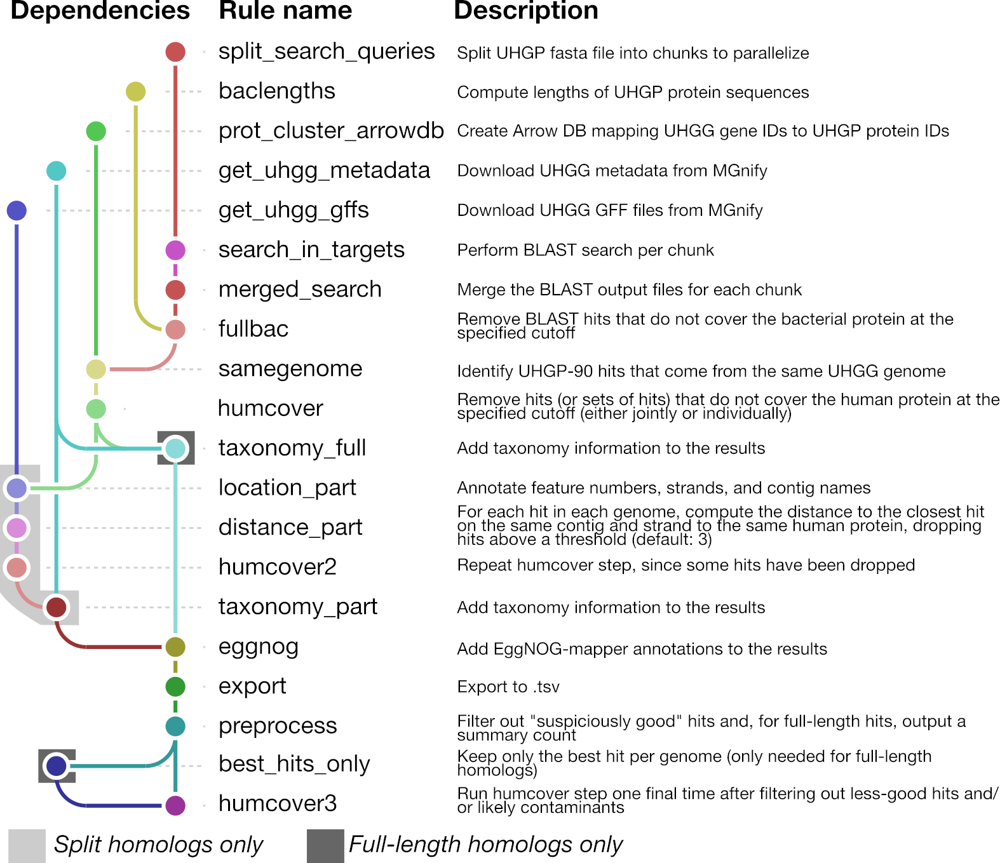

# Pipeline implementation for split and full-length homolog identification

This repository contains the Snakemake pipeline used in the manuscript "Human xenobiotic metabolism proteins have full-length and split homologs in the gut microbiome."

## Dependencies

This pipeline is written in Snakemake. Scripts called by the pipeline are written either in Python (using a combination of polars and pandas) or in R. Analysis scripts run after the pipeline is complete are located in `./analyses/` and are written in R.

The environment used has been exported to the file `xenobiotics.yml`. We recommend using [miniforge](https://github.com/conda-forge/miniforge) to manage dependencies. Once you have installed miniforge, to create a new conda environment from this file and activate it, use:

```
conda env create --name xenobiotics --file=xenobiotics.yml
conda activate xenobiotics
```

## Usage and configuration

To run this pipeline with default settings, you can use the "run" wrapper provided:

```
./run all
```

This wrapper uses the Snakemake profile at `smk_profile/config.yaml`. By default, this is symlinked to `smk_profile/osc.yaml`, a profile optimized for the [OSC](https://www.osc.edu) Cardinal cluster, a SLURM system. If you are running on a different cluster, you will likely have to provide your own profile or edit `smk_profile/config.yaml`.

Alternatively, you can run the pipeline locally with the following wrapper:

```
./local_run all
```

This expands to the following Snakemake command, which you can also run directly:

```
snakemake -s fusion_candidates.smk --stats logs/stats-$(date +%Y%m%d.%H%M) --use-conda all
```

As with other Snakemake pipelines, you can also specify a particular file that you want the pipeline to generate, e.g.:

```
./run data/processed/humcover3/HumanUPR_0.67_src_20000_70/part_humcover3.ipc
```

## Pipeline design

Snakemake pipelines are structured as a sequence of rules that generate final or intermediate output files from other inputs. Given a request for a particular output file, Snakemake finds a rule that can produce it, then determines which input files are necessary. If those input files are not found, it looks for rules that can generate them, and so forth until it reaches a set of rules where all the inputs are available. This chain of dependencies is illustrated in the following modified [Snakevision](https://github.com/OpenOmics/snakevision) plot. An arrow from rule A to rule B means that rule B depends on the output of rule A:



A description of the individual rules follows, along with the scripts or programs they call (see `./scripts/`) and whether they are necessary for the full-length/split homologs or both:

| **Rule** | **Scripts/Programs** | **Description** | **Full/Split** | Notes | Output [^4] |
| --- | --- | --- | --- | --- | --- |
| **get_uhgg_gffs** | `scripts/get_uhgg_gffs.py` | Download UHGG GFF files from MGnify. | split |  [^1] | `data/raw/UHGG_srcgenomes_GFFs/*` |
| **get_uhgg_metadata** | `curl` | Download UHGG metadata from MGnify. | both | | `data/raw/genomes-all_metadata.tsv` |
| **split_search_queries** | `scripts/split_fasta.py` | Split UHGP fasta file into chunks. | both | | `data/processed/split_search_queries/HumanUPR/UHGP-90_queries/*` |
| **search_in_targets** | `blastp` | Perform BLAST search per chunk. | both | | `data/processed/search_in_targets/HumanUPR/blast_*.tsv` |
| **merged_search** | `cat` | Merge BLAST results. | both | | `data/processed/merged_search/HumanUPR/U90_in_HumanUPR_20000tseqs.tsv` |
| **baclengths** | `scripts/compute_sequence_lengths.py` | Compute lengths of UHGP protein sequences. | both | | `data/processed/baclengths/uhgp-90_lengths.pkl`|
| **fullbac** | `scripts/fusion_candidates_baclength.py` | Remove hits that do not cover the bacterial protein at the specified cutoff. | both | | `data/processed/fullbac/HumanUPR/HumanUPR_{bac_overlap}_fullbac.pkl` |
| **prot_cluster_arrowdb** | `scripts/uhgp_to_arrow.R` | Create [Arrow](https://arrow.apache.org/docs/r/) DB mapping UHGG gene IDs to UHGP protein IDs. | both | | `data/processed/samegenome/HumanUPR/HumanUPR_{bac_overlap}_src_20000/samegenome.ipc` |
| **samegenome** | `scripts/samegenome_polars.py` | Identify UHGP-90 hits that come from the same UHGG genome. | both | | `data/processed/samegenome/HumanUPR/HumanUPR_{bac_overlap}_src_20000/samegenome.ipc` |
| **humcover** | `scripts/humcover_polars.py` | Remove hits (or sets of hits) that do not cover the human protein at the specified cutoff (either jointly or individually). | both | [^2] | `data/processed/humcover/HumanUPR/HumanUPR_{bac_overlap}_src_20000_{pf}{len}_humcover.ipc` |
| **taxonomy_full** | `scripts/fusion_candidates_taxonomy.py` | Add taxonomy information to the results | full | | `data/processed/taxonomy/HumanUPR/HumanUPR_{bac_overlap}_src_20000_full{pf}{len}_taxonomy.ipc` |
| **location_part** | `scripts/localize_hits` (Python) | Annotate feature numbers, strands, and contig names | part | | `data/processed/location/HumanUPR/HumanUPR_{bac_overlap}_src_20000_part{pf}{len}_location.ipc` |
| **distance_part** | `scripts/distance_polars.py` | For each hit in each genome, compute the distance to the closest hit on the same contig and strand to the same human protein, dropping hits above a threshold (default: 3) | part | | `data/processed/distance/HumanUPR/HumanUPR_{bac_overlap}_src_20000_part{pf}{len}_distance.ipc` |
| **humcover2** | `scripts/humcover_polars.py` | Repeat humcover step, since some hits have been dropped | part |  | `data/processed/humcover2/HumanUPR/HumanUPR_{bac_overlap}_src_20000_part{pf}{len}_humcover.ipc` |
| **taxonomy_part** | `scripts/fusion_candidates_taxonomy.py` | Add taxonomy information to the results | part | | `data/processed/taxonomy/HumanUPR/HumanUPR_{bac_overlap}_src_20000_part{pf}{len}_taxonomy.ipc` |
| **eggnog** | `scripts/annotate_eggnog.py` | Remove hits (or sets of hits) that do not cover the human protein at the specified cutoff (either jointly or individually). | both | | `data/processed/eggnog/HumanUPR/HumanUPR_{bac_overlap}_src_20000_{pf}{len}_eggnog.ipc` |
| **export** | `scripts/convert_df` (Python) | Export to .tsv | both | | `data/processed/export/HumanUPR/HumanUPR_{bac_overlap}_src_20000_{pf}{len}_eggnog.tsv`|
| **preprocess** | `scripts/preprocess-large-files.R` | Filter out "suspiciously good" hits and, for full-length hits, output a summary count | both | | `data/processed/preprocess/HumanUPR_{bac_overlap}_src_20000_{len}/{pf}_no_contaminants.ipc` |
| **best_hits_only** | `scripts/best_hits_only.py` | Keep only the best hit per genome (only needed for full-length homologs) | full | [^3] | `data/processed/bho/HumanUPR_{bac_overlap}_src_20000_{len}/full_no_contaminants.ipc` |
| **humcover3** | `scripts/best_hits_only.py` | Run humcover step one final time after filtering out less-good hits and/or likely contaminants | both | [^2] | `data/processed/humcover3/HumanUPR_{bac_overlap}_src_20000_{len}/{pf}_humcover3.ipc` |


[^1]: Only the split homolog branch of the pipeline requires feature numbers, strands, and contig information from the full GFF files.
[^2]: The humcover script can be run in either "part" or "full" mode, and has different behavior (either searching for groups of bacterial proteins that jointly, but not individually align to human proteins above the coverage threshold, or for single bacterial proteins that align to human proteins above the coverage threshold).
[^3]: A dummy version of this rule, `best_hits_only_dummy`, symlinks the necessary file from the "preprocess" step for the split pipeline.
[^4]: Some paths may be partially determined by the type of analysis run. The variable parts of the path are listed in `{curly_brackets}`. Key: bac_overlap = bacterial overlap threshold; len = human overlap threshold; pf = part/full.

### Files 

Input files, including those downloaded by the pipeline, are found in `data/raw` and `data/manual`. Files generated from these inputs by the pipeline will be placed in `data/processed`.

## Analysis

First, download the following files to `data/manual`:

 * `uniprot_output.tsv.gz`: Information about all human proteins in UniProt with GO annotations. Can be generated through the REST API at [this URL](https://rest.uniprot.org/uniprotkb/stream?compressed=true&fields=accession%2Creviewed%2Cid%2Cprotein_name%2Cgene_names%2Corganism_name%2Clength%2Cgo_p%2Cgo_c%2Cgo_f%2Cprotein_families%2Ccc_domain%2Cft_domain%2Cec%2Cxref_biocyc%2Cxref_interpro%2Cxref_pfam%2Ccc_subcellular_location&format=tsv&query=%28%28taxonomy_id%3A9606%29%29).
 * `hgnc_complete_set.txt`: Can be downloaded from HUGO at [this URL](https://storage.googleapis.com/public-download-files/hgnc/tsv/tsv/hgnc_complete_set.txt).
 * `goa_human.gaf.gz`: Can be downloaded from GO at [this URL](https://current.geneontology.org/products/pages/downloads.html).
 
Also, download the following files to `data/raw`:
 * `pharmgkb/chemicals/`, `pharmgkb/genes/`, `pharmgkb/pathways-tsv/`, `pharmgkb-relationships/`: Can be downloaded from PharmGKB. Should be unzipped into the listed directories directly below `data/raw`.


Next, change to the `analyses` directory, start R, and run the following:

```
source("compare_full_part.R")
source("new_pharmgkb.R")
```
